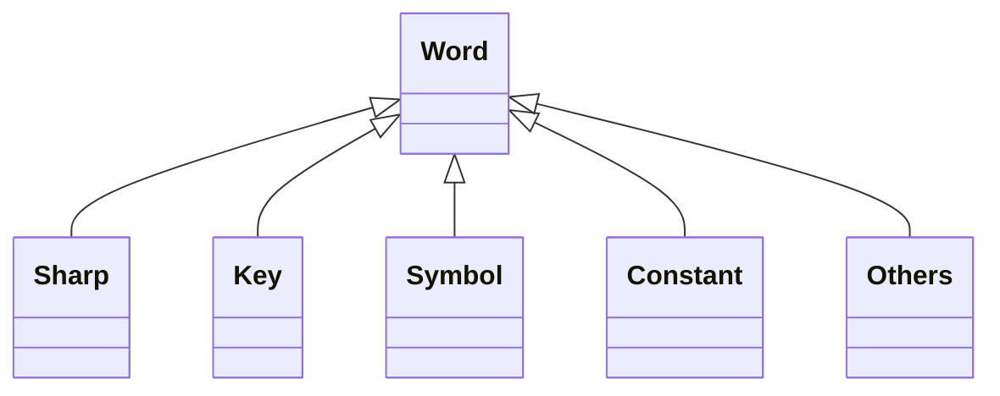
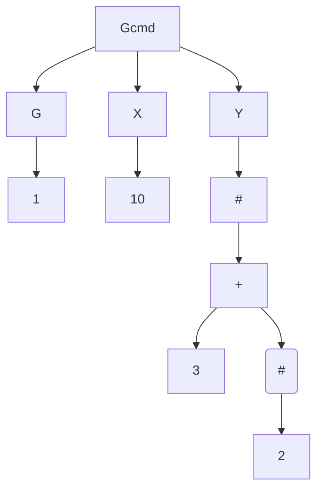
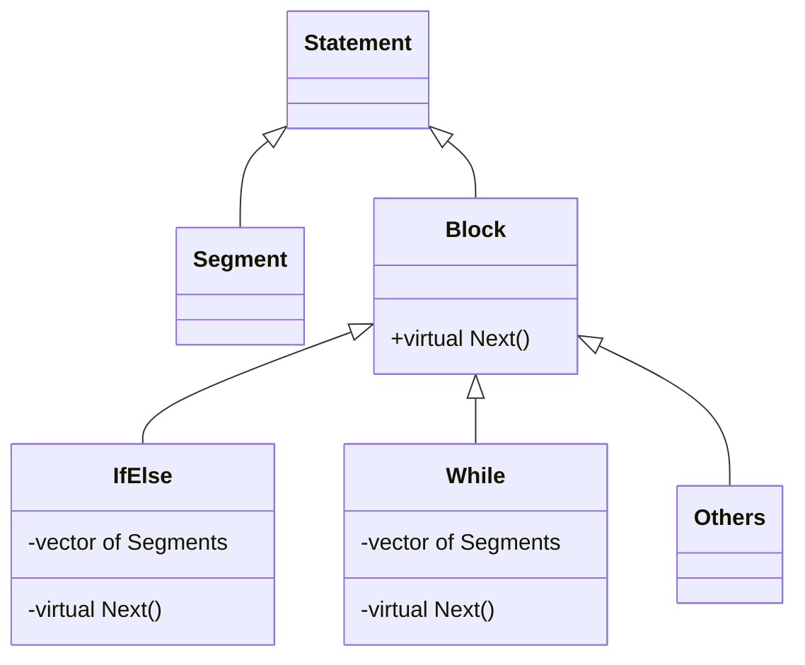
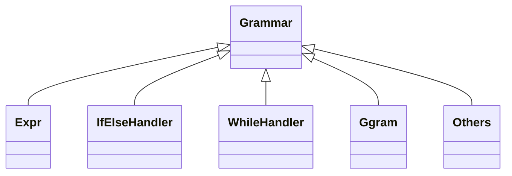
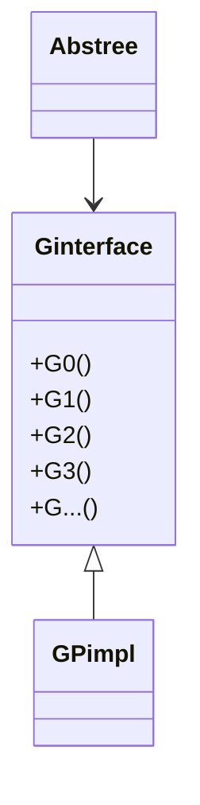

# 宏程序解析设计方案

## 概述

在G指令编程中，需要支持宏程序编程，也就是俗称的#变量。宏程序语法近似于高级编程语言语法，如果与C语言进行对比，它相当于C语言的简化版，具有部分C语言特征。具体特征如下：

- 支持变量声明，也就是#变量声明
- 支持#变量的单目运算，如：正、负、非、三角函数（正弦、余弦等）等
- 支持#变量的双目运算，如：加、减、乘、除、赋值、取余数、比较（大于、小于等）等
- 支持#变量的多元运算，如：取最大值、取最小值等
- 支持括号及其嵌套
- 支持格式化字符串
- 支持条件语句 IF/ELSEIF/ELSE
- 支持循环语句 WHILE
- 支持GOTO语句
- 支持传统G指令语法

为了解析程序可以支持上述能力，需要设计一个与之匹配的代码框架，该框架应该具备以下几点特征：

- 可维护性。
  当出现bug时，能根据各单元的职责划分，轻易定位问题所在。并且，修改bug只局限在特定区域，不应对其他无关代码造成影响。
- 可扩展性。
  增加一个可预见的扩展，比如增加一种双目运算符，只需通过类比手段，增量添加少量代码，即可完成，对原有代码和功能不产生影响。
- 可读性。
  代码要有层次。越是被依赖的底层代码，越展现高层逻辑，代码也更加稳定。分清楚哪些是不变的部分，哪些是经常变化的，经常变化的部分，可以封装起来，也可以由外部注入。
- 可测性。
  模块或类与外界的唯一通信方式是接口，只有接口可以引起其内部状态发生变化，切断与其他模块或类的一切耦合，那么这样的单元是可测的。
- 可复用性（DRY）。
  模块内部的代码应高度复用。
- 可移植性。
  把模块功能一开始就作为库来开发。与其依赖者没有直接耦合，一切通过接口交互。
- 稳定性
  稳定且不出现难以排查的错误，比如内存问题、偶发的多线程问题等。

本文的所有内容，皆是为了达成上述目标而做出的努力。

## 设计思路

设计上总体以SOLID原则为指导，配合一些编程范式和惯用法（idioms），对软件的各种成分进行抽象。

大方向上，按照编译原理的常规做法，分为**词法分析**、**语法分析**和**语义分析**等三个主要成分。

下面对这三个成分进行逐一展开。

### 1. 词法分析

任何单一功能单元，都需要明确其接口和输入输出，词法分析也不例外。

##### 输入

词法分析的输入是：一个流。这个流是一种抽象，它可以是文件流、也可以是字符串流，任何符合流定义的数据结构，都可以作为输入。

流的要求只需实现下面三个接口即可。

```c++
class Stream {
public:
    int get();	// 得到下一个字符，检索位置+1
    int peek();	// 窥视下一个字符，检索位置不变
    bool eof();	// 判断是否到达末尾
};
```

##### 输出

词法分析的输出是：种别码（单词）。

种别码是按照传统编译原理定义的名称，它是个二元组，由单词类型和它的值组成，形式如下：

```c++
struct Token {
    Kind kind;
    double value{ nan };
};
```

##### 接口

词法分析的接口是下面两个方法：

```c++
class Lexer {
	token::Token Get();		// 得到下一个单词，检索位置+1
	token::Token Peek();	// 窥视下一个单词，检索位置不变
};
```

词法分析的依赖者可以通过上面两个接口，按顺序获得种别码。

另外，词法分析还定义了单词类别以及类别与字符串之间的映射关系。

```c++
enum class Kind {
    CON,			// 常量
    IDN,				// 标识符
    FOR,				// for
    IF,					// IF
    ELSE,			// ELSE
    LB,				// [
    RB,				// ]
    POS,				// +
    ...
};

inline const Dictionary keywords = {
    {"IF", Kind::IF},
    {"ELSEIF", Kind::ELSEIF},
    {"ELSE", Kind::ELSE},
    {"ENDIF", Kind::ENDIF},
    {"THEN", Kind::THEN},
    {"WHILE", Kind::WHILE},
    {"DO", Kind::DO},
    {"END", Kind::END},
    ...
};
```

##### 单词匹配

词法分析各单词的处理方式，存在着相似性，且未来存在增加新单词类型的可能性。因此，需要进行抽象。

具体做法就是：

1. 定义一个抽象单词处理类

   ```c++
   class Word {
   public:
       virtual ~Word() = default;
       virtual bool First(char) const = 0;
       virtual std::optional<token::Token> Rest(std::string&, const Utils&) const = 0;
   };
   ```

2. 使用模板方法模式（TemplateMethod），固化高层逻辑。

   ```c++
   token::Token _Next() {
       ...
       for (const auto& p : WordsList::words) {
           std::optional<token::Token> tok;
           // 判断第一个字符是否匹配，如果第一个字符匹配将进入至Rest函数，第一参数string携带已经匹配的字符。
           // 如果匹配失败，则进行下一个种别的单词匹配，直至完全匹配成功。如果一个都没有匹配成功，将抛出词法异常。
           // utils为被调用者提供get、peek等能力。
           if (p->First(ch) && (tok = p->Rest(word, { peek, get, _lasttok })).has_value()) {
               return tok.value();
           }
       }
       ...
   }
   ```

3. 扩展Word

   ```c++
   class Sharp : public Word {		// 井变量
   private:	// 注：这里全是私有，也就是说基类的虚函数调用是这些重写函数的唯一驱动方式。
       virtual bool First(char ch) const override {
           return IsSharp(ch);
       }
   
       virtual std::optional<token::Token> Rest(std::string& word, const Utils& utils) const override {
           assert(IsSharp(word));
           return token::Token{ token::Kind::SHARP, nan };
       }
   };
   
   class Key : public Word {...};	// 关键字
   class Symbol : public Word {...};	// 运算符
   class Constant : public Word {...};	// 常量
   ...
   ```

类图表示为：



上述抽象方式，可以方便增添新的单词类别，并对现有单词解析不产生影响。

### 2. 语法分析

语法分析的目标，是把单词流翻译为一棵棵的语法树。

相对于词法分析，语法分析要复杂得多，但是与词法分析一样，也需要定义语法分析模块的接口以及输入输出。

##### 输入

词法分析的输入是词法分析的输出，也就是种别码，或称为单词更加贴切。

##### 输出

词法分析的输出是一棵语法树。关于语法树，在后文详细描述。

##### 接口

接口只有一个，就是获取下一个程序段的语法树。

```c++
std::optional<Abstree> Next();
```

##### 抽象语法树

抽象语法树是描述句子的一种数据结构，也是语法分析与语义分析的中间状态，以下简称语法树。

语法树把语法解释和语法执行进行了解耦，因此，产生语法树并不会对运行时环境产生影响。它本质上是一份描述可执行语句的数据，只不过由于它的树状结构，因此叫做语法树。

语法树的定义

```c++
class Abstree {
public:
    struct Node;
    using NodePtr = ClonePtr<Node>;

    // 树状结构，可以有若干棵子树
    struct Node {
        Predicate pred;				// 谓词
        std::vector<NodePtr> subs;	// 子树
    };
	
    // 树的地址表和返回值是可以剥离的，并不与语法树强绑定
    Abstree(NodePtr&& root, Address& addr, Value* ret = nullptr) noexcept;
    
    // 可执行
    Value operator()(Ginterface* pimpl = nullptr);

private:
    NodePtr _root;
    Address& _addr;
    Value* _return_val{ nullptr };
};
```

举例来说：

例1：表达式`#1=#2+#3*#4`的语法树

```mermaid
graph
    =-->#1(#) & +
    #1-->1
    +-->#2(#) & *
    #2-->2
    *-->#3(#) & #4(#)
    #3-->3
    #4-->4
```

例2：G代码`G1 X10 Y#[3+#2]`的语法树



##### 谓词

语法树中，每个节点都是谓词，它是句子成分的核心，也是一个可呼叫单位（callable）。

例如加号，它实际被映射到一个加法函数，并把两棵子树的返回值传入该函数，计算出相应的值。

又例如常量，其计算结果为其本身。

谓词的定义如下：

```c++
using Predicate = std::variant<Value, Unary, Binary, Sharp, Gcmd>;
```

谓词的调用使用std::variant和std::visit实现，代码如下：

```c++
return std::visit(
    Overload
    {
        [&](const Value& value) {
            return value;
        },
        [&](const Unary& unary) {
            return std::visit([&](auto&& func) { return func(params[0]); }, unary);
        },
        [&](const Binary& binary) {
            return std::visit([&](auto&& func) { return func(params[0], params[1]); }, binary);
        },
        [&](const Sharp& sharp) {
            return std::visit([&](auto&& func) { return func(params[0], _addr); }, sharp);
        },
        [&](const Gcmd& gcmd) {
            return std::visit([&](auto&& func) {return func(params, pimpl, _addr); }, gcmd);
        },
        [&](const auto&)->Value { // default
            throw AbstreeException();
        },
    }, node->pred);
```

##### 语句（STATEMENT）

语句是一组代码，用于执行某些任务或操作。语句可以是单行语句或多行语句，单行语句由换行或分号隔开，而多行语句则是特定的语法段落。

语句分两类：

1. 单行语句由一个表达式构成，把它称为一个程序段（SEGMENT）
2. 多行语句由一个厚块构成，它是程序段的集合

###### 程序段（SEGMENT）

在宏程序中，一个程序段就是一个表达式，它可以表示为一棵语法树。

关于表达式，这里给出百度百科的定义：

> 表达式，是由数字、算符、数字分组符号（括号）、自由变量和约束变量等以能求得数值的有意义排列方法所得的组合。（引用自百度百科）

通常表达式可以有返回值，也可以返回值为空。普通表示通常有返回值，而G代码表达式返回值为空。

程序段在程序中由单词（token）序列构成，通过算法可以生成语法树。算法的声明如下：

```c++
class Expression {
public:
	Abstree::NodePtr operator()(Segment&&) const;
};

inline constexpr Expression expr;
```

具体算法，包含两种递归：

1. 在单词序列中查找优先级最低的单词，单词左边和单词右边形成两个单词序列，作为两棵子树进行递归调用。子树生成后结合当前节点，生成完整的一棵树。单词的优先级查找根据不同类型的操作符进行正向或逆向查找（因为有的从左往右计算，有的从右往左计算，比如加、减、乘、除是从左往右，正号、负号、#是从右往左）。
2. 出现括号时，将括号内部的单词序列（去除括号本身），递归调用自身，生成一棵子树，该子树与单词一起存储在单词列表中。生成语法树时，普通单词会产生一个节点，链接到语法树上，而括号产生的子树则直接将其根节点链接到语法树上。

###### 代码块（BLOCK）

语句中除了普通程序段以外，另一类就是代码块，比如条件语句IF-ELSE和WHILE循环。

这类语法不宜直接生成语法树，而应该视为程序段的集合，可生成多课语法树。

代码块概念作为IF-ELSE语法和WHILE语法的共同抽象，未来如果需要支持FOR或SWITCH语法，可以在此维度上进行扩展。

###### 语句、程序段、代码块三者的关系

三者的类图如下：



其中，

Statement的声明：

```c++
struct Statement {
    std::variant<Segment, ClonePtr<Block>> statement;
    size_t line{ 0 };
};
```

Block的声明：

```c++
class Block {
public:
    virtual ~Block() = default;
    virtual std::optional<Statement> Next() = 0;		// 得到下一个Segment，该Segment必然是表达式
    virtual std::unique_ptr<Block> Clone() const = 0;	// 实现抽象类指针的深拷贝
};
```

IfElse的声明：

```c++
class IfElse : public Block{
    virtual std::optional<Statement> Next() override;
    
    struct If {
        Statement cond;	// 条件语句
        std::vector<Statement> scope;	// 语句的集合
    };

    struct Else {
        std::vector<Statement> scope;	// 语句的集合
    };

    std::vector<If> _ifs;	// IF或ELSEIF集合
    Else _else;				// ELSE
    size_t _curseg{ 0 };
    bool _iscond{ true };
    const Value& _return;
    size_t _scopeindex{ 0 };
}
```

###### 语句的分析过程

在语法分析的过程中，如果匹配到的是程序段，则读完该程序段直接生成语法树。如果是厚块，不妨假设为IF-ELSE，那么需要把整个IF-ELSE段落的单词全部读完，包括其内嵌套的程序段和其他厚块。所有语句及其嵌套语句，存入IfElse对象的数据结构中。其中嵌套的厚块，以指针形式存在于IfElse中，而该厚块可能还嵌套其他厚块，那么继续以指针形式存储，相当于以树状结构进行链接。

程序段可直接生成语法树，而厚块则可通过调用Next方法，获得其下一个程序段，间接生成语法树。厚块内部如嵌套其他厚块，则继续调用此厚块的Next方法，层层递进，直至获得一个程序段为止。

##### 语法匹配

与词法分析类似，语法分析时，各类语法的匹配也存在着共性，应该进行抽象。

其抽象类声明为：

```c++
class Grammar {
public:
    virtual ~Grammar() = default;
    virtual bool First(const token::Token&) const = 0;	// 匹配第一个单词
    virtual std::optional<Statement> Rest(Segment&&, const Utils&) const = 0; // 匹配剩余单词
};
```

派生类声明为：

```c++
class Expr : public Grammar {...};
class IfElse : public Grammar {...};
class While : public Grammar {...};
class Ggram : public Grammar {...};
```

调用方式与词法分析类似，使用模板方法模式，固化高层逻辑。

类图表示为



##### 地址表

#变量既然是变量，自然需要给每个变量分配一块地址，而每个地址又对应一个值，用哈希表对这些值进行存储。

```c++
class Address {
public:
    using _Key = double;				// key是#变量编号
    using _Value = ClonePtr<double>;	// value是#变量的地址

    _Value& operator[](const _Key& key);
    const _Value& operator[](const _Key& key) const;
    bool Contains(const _Key& key) const;
    void Clear();

private:
    std::unordered_map<_Key, _Value> _dict;
};
```

该地址表存放于语法分析器内，只有当输出的语法树被执行时，地址表中的值才可能发生变化。

### 3. 语义分析

语义分析仅仅按顺序执行语法分析产生的语法树，对运行时环境产生影响。

运行时环境分两部分：

1. 地址表
   这部分考虑到语法分析的连贯性，应该由语法分析单元持有。语义分析提供以只读形式读取地址表。

2. G指令的运行时状态
   这部分由本模块提供纯虚接口，通过外部注入（plugin）的方式，本身不持有外部任何状态。其类关系图如下



其接口大致如下

```c++
class Gparser {
public:
    void Run(Ginterface& pimpl);	// 解析
    const Address& Addr() const;	// 获取#地址表
};
```

  ## 技术

本方案使用多种编程范式，其中用到一些最新的技术手段。

- 使用最多的是variant+visit技术，它在类型消除上可代替OOP，性能上也更优。
- copy and swap。此为C++习惯用法之一。
- clone技术。抽象类指针实现深拷贝的方法。
- 全部指针使用unique_ptr。可避免任何内存泄漏、野指针、悬空指针问题。

(谢谢阅读！完)